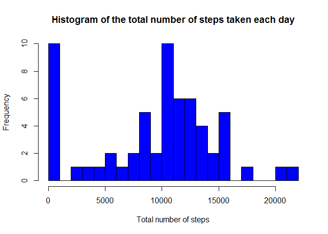
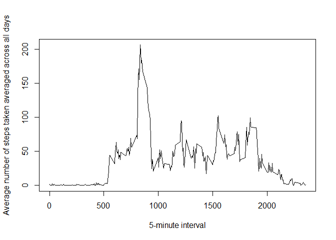

# Reproducible Research: Peer Assessment 1


## Loading and preprocessing the data


```r
#Unzip and load data file
unzip("activity.zip")
data <- read.csv("activity.csv")

#Convert column date type into Date format
data$date <- as.Date(data$date, "%Y-%m-%d")
```


## What is mean total number of steps taken per day?
1. Total number of steps taken per day

```r
library(dplyr)
total_steps <- summarize(group_by(data, date), steps=sum(steps, na.rm=TRUE))
```


2. Histogram of the total number of steps taken each day

```r
hist(total_steps$steps, main = "Histogram of the total number of steps taken each day", xlab = "Total number of steps", col="blue", nclass=20)
```

 

3. Mean and median of the total number of steps taken per day

3.1 Compute mean and median

```r
mean(total_steps$steps)
```

```
## [1] 9354.23
```

```r
median(total_steps$steps)
```

```
## [1] 10395
```


3.2 Report mean and median

```r
hist(total_steps$steps, 
     main = "Histogram of the total number of steps taken each day", 
     xlab = "Total number of steps", col="blue", nclass=20)
abline(v=mean(total_steps$steps), col="red", lwd=2)
abline(v=median(total_steps$steps), col="green", lwd=2)
legend("topright", lwd=c(2,2),col = c("red", "green"), 
       legend = c("mean","median"))
```

 

## What is the average daily activity pattern?
1. Time series plot of the 5-minute interval and the average number of steps 
taken, averaged across all days

```r
library(dplyr)
avg_interval_steps <- summarize(group_by(data, interval), 
                                steps=mean(steps, na.rm=TRUE))

plot(avg_interval_steps$interval, avg_interval_steps$steps, type="l", 
     xlab="5-minute interval", 
     ylab="Average number of steps taken averaged across all days")
```

 

2. Which 5-minute interval, on average across all the days in the dataset, 
contains the maximum number of steps?


```r
idx_max <- which.max(avg_interval_steps$steps)
avg_interval_steps[104,]
```

```
## Source: local data frame [1 x 2]
## 
##   interval    steps
## 1      835 206.1698
```

## Inputing missing values
1. Total number of missing values in the dataset 


```r
sum(is.na(data$steps))
```

```
## [1] 2304
```

2. Strategy for filling in all of the missing values in the dataset  
Missing values will be filled with the corresponding mean for that 5-minute 
interval.  

3. New dataset with missing data filled in

```r
filled_data <- data
for( i in 1:nrow(filled_data)) {
    if(is.na(filled_data[i,1])) {
        filled_data[i,1] <- 
            avg_interval_steps[avg_interval_steps$interval==filled_data[i,3],2]
    }        
}
```


4. Make a histogram of the total number of steps taken each day and Calculate 
and report the mean and median total number of steps taken per day. Do these 
values differ from the estimates from the first part of the assignment? What is 
the impact of imputing missing data on the estimates of the total daily number 
of steps?

## Are there differences in activity patterns between weekdays and weekends?
