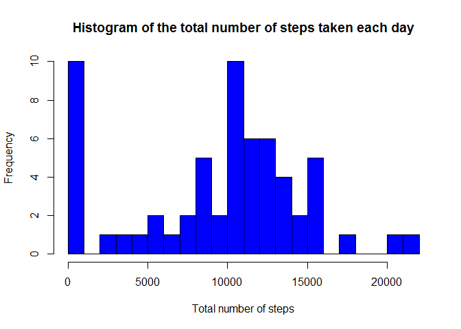
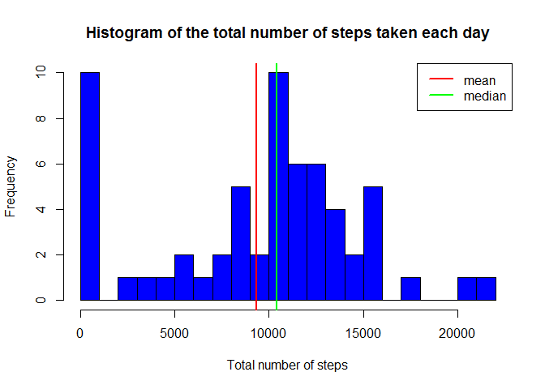
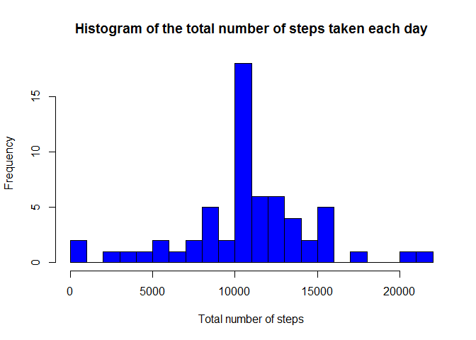
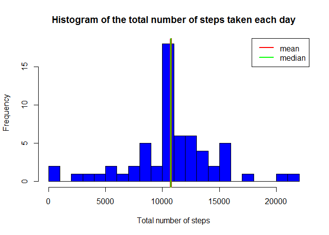
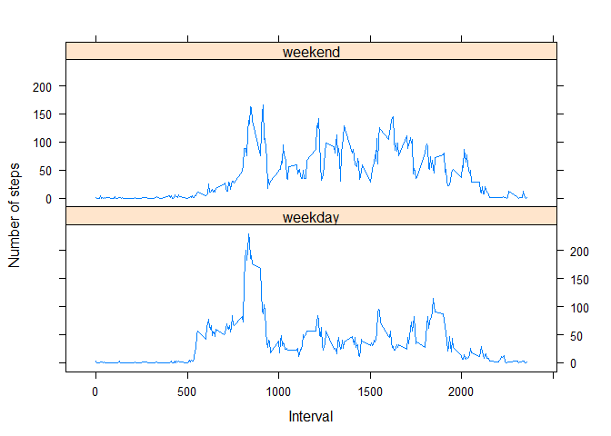

# Reproducible Research: Peer Assessment 1


## Loading and preprocessing the data


```r
#Unzip and load data file
unzip("activity.zip")
data <- read.csv("activity.csv")

#Convert column date type into Date format
data$date <- as.Date(data$date, "%Y-%m-%d")
```


## What is mean total number of steps taken per day?
1. Total number of steps taken per day

```r
library(dplyr)
total_steps <- summarize(group_by(data, date), steps=sum(steps, na.rm=TRUE))

head(total_steps)
```

```
## Source: local data frame [6 x 2]
## 
##         date steps
## 1 2012-10-01     0
## 2 2012-10-02   126
## 3 2012-10-03 11352
## 4 2012-10-04 12116
## 5 2012-10-05 13294
## 6 2012-10-06 15420
```

```r
hist(total_steps$steps, 
     main = "Histogram of the total number of steps taken each day", 
     xlab = "Total number of steps", col="blue", nclass=20)
```

 

2. Mean and median of the total number of steps taken per day


```r
mean(total_steps$steps)
```

```
## [1] 9354.23
```

```r
median(total_steps$steps)
```

```
## [1] 10395
```


3. Histogram of the total number of steps taken each day with mean and median 
reported

```r
hist(total_steps$steps, 
     main = "Histogram of the total number of steps taken each day", 
     xlab = "Total number of steps", col="blue", nclass=20)
abline(v=mean(total_steps$steps), col="red", lwd=2)
abline(v=median(total_steps$steps), col="green", lwd=2)
legend("topright", lwd=c(2,2),col = c("red", "green"), 
       legend = c("mean","median"))
```

 

## What is the average daily activity pattern?
1. Time series plot of the 5-minute interval and the average number of steps 
taken, averaged across all days

```r
library(dplyr)
avg_interval_steps <- summarize(group_by(data, interval), 
                                steps=mean(steps, na.rm=TRUE))

plot(avg_interval_steps$interval, avg_interval_steps$steps, type="l", 
     xlab="5-minute interval", 
     ylab="Average number of steps taken averaged across all days")
```

 

2. Which 5-minute interval, on average across all the days in the dataset, 
contains the maximum number of steps?


```r
idx_max <- which.max(avg_interval_steps$steps)
avg_interval_steps[104,]
```

```
## Source: local data frame [1 x 2]
## 
##   interval    steps
## 1      835 206.1698
```

## Inputing missing values
1. Total number of missing values in the dataset 


```r
sum(is.na(data$steps))
```

```
## [1] 2304
```

2. Strategy for filling in all of the missing values in the dataset  
Missing values will be filled with the corresponding mean for that 5-minute 
interval.  

3. New dataset with missing data filled in

```r
filled_data <- data
for( i in 1:nrow(filled_data)) {
    if(is.na(filled_data[i,1])) {
        filled_data[i,1] <- 
            avg_interval_steps[avg_interval_steps$interval==filled_data[i,3],2]
    }        
}


head(filled_data)
```

```
##       steps       date interval
## 1 1.7169811 2012-10-01        0
## 2 0.3396226 2012-10-01        5
## 3 0.1320755 2012-10-01       10
## 4 0.1509434 2012-10-01       15
## 5 0.0754717 2012-10-01       20
## 6 2.0943396 2012-10-01       25
```


4. Histogram of the total number of steps taken each day with filled data set

* Total number of steps taken per day

```r
library(dplyr)
filled_total_steps <- summarize(group_by(filled_data, date), 
                                steps=sum(steps, na.rm=TRUE))

hist(filled_total_steps$steps, 
     main = "Histogram of the total number of steps taken each day", 
     xlab = "Total number of steps", col="blue", nclass=20)
```

 

* Mean and median of the total number of steps taken per day


```r
mean(filled_total_steps$steps)
```

```
## [1] 10766.19
```

```r
median(filled_total_steps$steps)
```

```
## [1] 10766.19
```


```r
hist(filled_total_steps$steps, 
     main = "Histogram of the total number of steps taken each day", 
     xlab = "Total number of steps", col="blue", nclass=20)
abline(v=mean(filled_total_steps$steps), col="red", lwd=4)
abline(v=median(filled_total_steps$steps), col="green", lwd=2)
legend("topright", lwd=c(2,2),col = c("red", "green"), 
       legend = c("mean","median"))
```

 

* Do these values differ from the estimates from the first part of the assignment? 
What is the impact of imputing missing data on the estimates of the total daily 
number of steps?

We can see that the frequency of very low values of daily total number of steps 
decreased a lot because missing values were filled.

Besides, frequency of average values of daily total number of steps increased as 
we choose to use the mean of 5-minute interval to fill the missing values. This
also explains why mean and median are now equal.

## Are there differences in activity patterns between weekdays and weekends?
1.New factor variable in the dataset with two levels indicating whether a given 
date is a weekday or weekend day


```r
library(dplyr)
Sys.setenv("LANGUAGE"="EN")
Sys.setlocale("LC_TIME", "English")
```

```
## [1] "English_United States.1252"
```

```r
filled_data <- mutate(filled_data, day_type = factor(weekdays(date) %in% c("Monday", "Tuesday", "Wednesday", "Thursday", "Friday"), levels=c(FALSE, TRUE), labels = c("weekend","weekday")))

#Quick check
head(filled_data)
```

```
##       steps       date interval day_type
## 1 1.7169811 2012-10-01        0  weekday
## 2 0.3396226 2012-10-01        5  weekday
## 3 0.1320755 2012-10-01       10  weekday
## 4 0.1509434 2012-10-01       15  weekday
## 5 0.0754717 2012-10-01       20  weekday
## 6 2.0943396 2012-10-01       25  weekday
```

```r
weekdays(filled_data[1,2])
```

```
## [1] "Monday"
```

```r
weekdays(filled_data[2000,2])
```

```
## [1] "Sunday"
```

```r
filled_data[2000,]
```

```
##      steps       date interval day_type
## 2000     0 2012-10-07     2235  weekend
```
2. Panel plot containing a time series plot of the 5-minute interval and the average number of steps taken, averaged across all weekday days or weekend days


```r
library(dplyr)
library(lattice)
avg_interval_steps <- summarize(group_by(filled_data, interval, day_type), 
                                steps=mean(steps, na.rm=TRUE))

xyplot(steps~interval | day_type, 
       avg_interval_steps, type="l", 
       xlab="Interval", 
       ylab="Number of steps", 
       layout = c(1, 2),
       as.table = TRUE)
```

 
